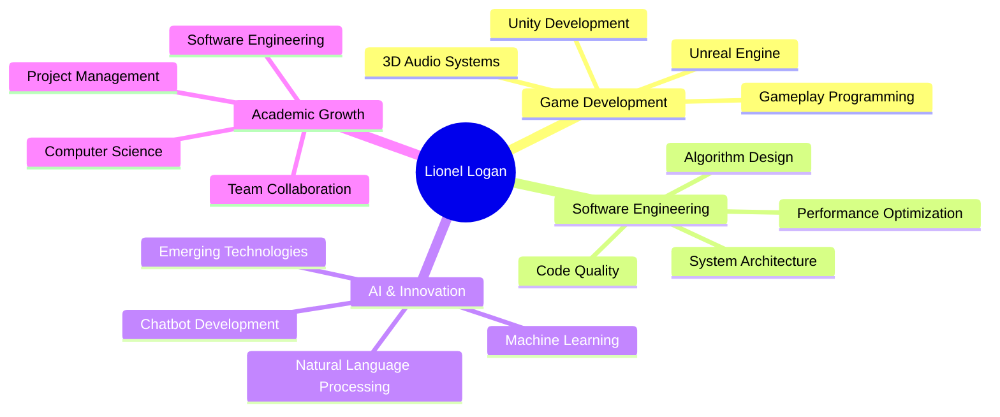

# Hi there, I'm Navneet Ranjish Pillai 👋

  

## 🎮 About Me

I'm a **B.Tech Computer Science and Engineering** student at **Govt. Model Engineering College, Kochi**, passionate about creating immersive gaming experiences and innovative software solutions. With a strong foundation in multiple programming languages and specialized expertise in game development, I'm constantly pushing the boundaries of interactive entertainment.

- 🎯 **Currently Focusing On:** Game Development & Computer Engineering
- 🎓 **Education:** B.Tech CSE at Model Engineering College, Kochi
- 🌍 **Location:** Kochi, Kerala, India
- 🎮 **Specialty:** Game & Gameplay Programming with Unreal Engine
- 🤖 **Interests:** AI Development, Interactive Entertainment, Software Engineering
- 📫 **Connect with me:** [LinkedIn](https://www.linkedin.com/in/navneet-ranjish-pillai-50a612257), [Portfolio](https://navneetranjishpillai.vercel.app)

## 🛠️ Tech Stack & Skills

### Programming Languages

### Game Development

### Web Technologies

### AI & Machine Learning

### Tools & Platforms

## 🎮 Featured Projects

### 🧳 [SyncTrek](https://navneetranjishpillai.vercel.app)
> **Personal Multi-Agent AI Powered Itinerary Generation Mobile App**

An intelligent travel planning application that leverages multi-agent AI systems to create personalized, comprehensive travel itineraries. Built with advanced AI algorithms to optimize travel experiences based on user preferences, budget, and time constraints.

**Key Features:**
- 🤖 Multi-agent AI system for intelligent planning
- 📱 Mobile-first responsive design
- 🗺️ Smart itinerary generation and optimization
- 💰 Budget-aware travel recommendations
- 🌍 Global destination coverage
- ⚡ Real-time travel data integration

**Tech Stack:** `FastAPI` `GenAI` `Python` `Mobile Development` `Multi-Agent Systems`

---

### 🎯 [Devils Reckoning](https://devilsreckoning.vercel.app)
> **High-Fidelity Unreal Engine 5 Shooter/Thriller Video Game**

An immersive shooter/thriller experience built with Unreal Engine 5, featuring cutting-edge graphics, advanced gameplay mechanics, and atmospheric storytelling. Combines intense action sequences with psychological thriller elements.

**Key Features:**
- 🎮 High-fidelity Unreal Engine 5 graphics
- 🔫 Advanced shooter mechanics and combat systems
- 🎭 Psychological thriller narrative elements
- 🌟 State-of-the-art visual effects and lighting
- 🎵 Immersive 3D audio design

**Tech Stack:** `Unreal Engine 5` `Blueprint` `Game Design`

---

### 🚗 [AutoHub](https://github.com/Lionel-Logan/AutoHub)
> **Comprehensive Automotive Platform Solution**

A robust automotive management platform developed in Java, providing comprehensive solutions for automotive businesses and enthusiasts. Features advanced data management, user interfaces, and scalable architecture.

**Key Features:**
- 🚗 Complete automotive management system
- 📊 Advanced data analytics and reporting
- 👥 Multi-user role management
- 🔧 Maintenance tracking and scheduling
- 📱 Cross-platform compatibility
- 🔐 Secure data handling and storage

**Tech Stack:** `Java` `Object-Oriented Programming` `Database Management` `Software Architecture`

## 🏆 Achievements & Experience

- 🎓 **Computer Science Engineering Student** at Govt. Model Engineering College
- 🎮 **Game Development Specialist** with Unreal Engine expertise
- 🏅 **Hackathon Participant** - TinkHack 2.0 (AI Chatbot Project)
- 💻 **Multi-language Programmer** - Proficient in 6+ programming languages
- 🎯 **Game & Gameplay Programming** specialist
- 🌟 **Open Source Contributor** with active GitHub presence

## 🎯 Current Focus Areas

## 🌐 Connect With Me

## 💼 What I'm Working On

- 🎮 **Game Development Projects**: Creating immersive gaming experiences with Unity and Unreal Engine
- 🤖 **AI Integration**: Exploring AI applications in game development and interactive systems
- 📚 **Academic Excellence**: Pursuing advanced computer science concepts and practical applications
- 🌟 **Open Source Contributions**: Contributing to the developer community through shared projects
- 🚀 **Skill Enhancement**: Continuously learning new technologies and development methodologies

## 🎯 Goals & Vision

As an aspiring **Computer Engineer** and **Game Developer**, I'm committed to:

- 🎮 Creating innovative and engaging gaming experiences
- 💻 Developing robust software solutions that make a real impact
- 🌟 Contributing to the open-source community
- 📈 Continuously learning and adapting to emerging technologies
- 🤝 Collaborating with fellow developers to build amazing projects

---

### "Code is like humor. When you have to explain it, it's bad." - Cory House

**Let's build something amazing together!** 🚀

